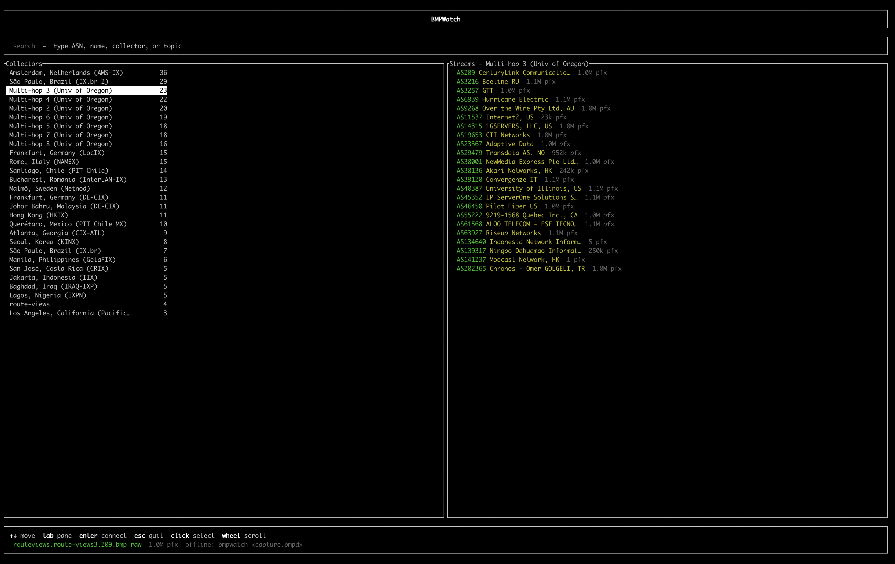
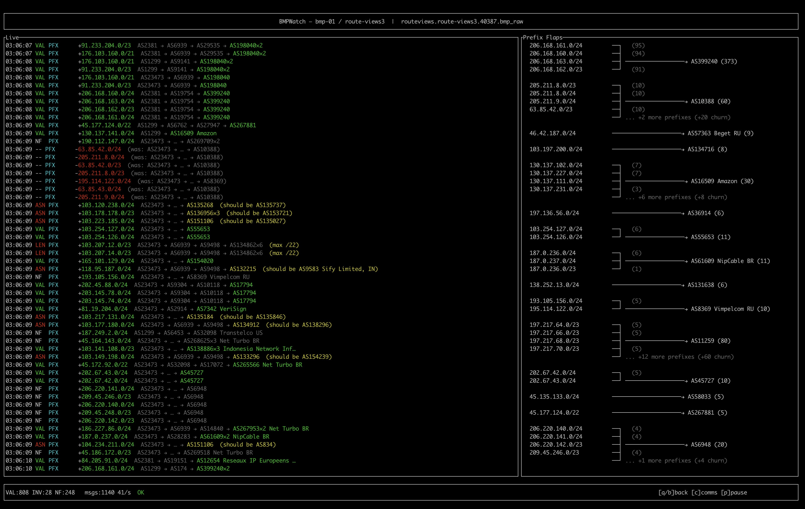

<div align="center">

# bmpwatch

**A terminal-native RouteViews BMP stream monitor with RPKI validation.**

[](LICENSE)
[](https://www.rust-lang.org)
[](https://github.com/downwithbgp/bmpwatch/actions/workflows/ci.yml)
[](https://crates.io/crates/bmpwatch)

</div>

bmpwatch connects to RouteViews' public BMP Kafka streams and provides an
interactive TUI dashboard for live route monitoring. It consumes
OpenBMP-wrapped Kafka payloads (not raw BMP TCP sessions), validates RFC 7854
framing, resolves AS names from multiple data sources, and cross-checks
announced prefixes against RPKI VRPs loaded from an RTR server.

> **Status:** experimental, pre-1.0, active development. CLI and TUI interfaces
> may change. Not yet published to crates.io — build from source.

```
 Interface    terminal UI (ratatui + crossterm)
 Input        RouteViews Kafka / OpenBMP-wrapped streams
 Enrichment   RouteViews peer metadata, AS-name cache, RPKI RTR
 RPKI source  rtr.rpki.cloudflare.com:8282
 Stability    pre-release tooling
```

## Preview

| Topic browser | Stream view |
| :-----------: | :---------: |
|  |  |

## What it does

bmpwatch provides four modes of operation:

| Mode | Command | Description |
|------|---------|-------------|
| **dashboard** | `bmpwatch` (default) | Live TUI with stream browser, message log, and RPKI validation |
| **inspect** | `bmpwatch inspect <file>` | Human-readable file summary with peer inventory and findings |
| **lint** | `bmpwatch lint <file>` | Machine-oriented finding output with exit codes |
| **dump** | `bmpwatch dump <file> --jsonl` | One JSON object per BMP message for scripting |

Plus the companion binary `record_openbmp_kafka` for offline capture.

## Features

**Live TUI dashboard**
- Search-powered stream browser with collector and stream panes
- Active peering filter — hides dead/inactive Kafka topics using RouteViews
  peering-status data
- Compact prefix counts in stream rows (sourced from bundled peer metadata)
- Scrolling message log with compact, deduplicated AS paths
- Prefix Flaps panel — prefixes grouped by origin ASN, sorted by churn
- Mouse support (click, double-click, wheel) alongside keyboard navigation
- Clean mode transitions between browser and topic views

**RPKI origin validation**
- Loads VRPs from an RTR server (default: `rtr.rpki.cloudflare.com:8282`)
- Cached locally for 72 hours
- Multi-covering-VRP-correct semantics: a route is Valid if *any* covering
  ROA authorizes the observed origin ASN and prefix length ≤ maxLength
- "should be ASxxxxx" hint only when the authorized origin is unambiguous

**AS name enrichment**
- Multi-tier resolution: bundled Cymru seed → user cache → bundled Cymru
  fallback → RouteViews peer metadata → raw ASN fallback
- Offline WHOIS refresh via `bmpwatch refresh-asnames`
- No network I/O during TUI operation

**BMP frame validation**
- RFC 7854 common header checks (version, length, type)
- Peer session lifecycle checks (Peer Up/Down ordering, RM before Peer Up)
- Timestamp regression detection
- OpenBMP `OBMP` unwrapping for RouteViews Kafka payloads

## Current status

bmpwatch is **pre-1.0, experimental software** under active development.
It is useful for live RouteViews BMP stream exploration and debugging, and it
is also intentionally being developed as a learning tool by the author while
studying BGP visibility, BMP/OpenBMP data, RPKI validation, and terminal UI
design.

It is not currently a production monitoring platform, a complete BMP
collector, or a replacement for full RPKI validators.

- APIs, CLI flags, and TUI layout may change between commits.
- Published to crates.io — `cargo install bmpwatch`.
- Tested on macOS and Linux. Windows is untested.

## Install

From crates.io:

```sh
cargo install bmpwatch
```

From source:

```sh
git clone https://github.com/downwithbgp/bmpwatch.git
cd bmpwatch
cargo install --path . --bin bmpwatch
```

Prebuilt binaries are available from [GitHub Releases](https://github.com/downwithbgp/bmpwatch/releases) for Linux (x86_64, ARM64) and macOS (Apple Silicon, Intel).

## Quick start

### Prerequisites

- Rust toolchain (stable, recent)
- Network access to `stream.routeviews.org:9092` for live mode

### Build

```sh
git clone https://github.com/downwithbgp/bmpwatch.git
cd bmpwatch
cargo build --release
```

### Run the TUI

```sh
# Open the stream browser (no arguments needed)
cargo run --bin bmpwatch

# With pre-filtering
cargo run --bin bmpwatch -- --collector chicago --asn 13335

# Connect directly to a specific topic
cargo run --bin bmpwatch -- --topic routeviews.chicago.13335.bmp_raw
```

### Offline smoke test

```sh
cargo test

cargo run --bin bmpwatch -- \
  inspect tests/fixtures/openbmp-two-records.bmpd --summary-json
```

Expected: `malformed_messages=0`, `total_messages=2`.

### Record a capture (network required)

```sh
cargo run -p record_openbmp_kafka -- \
  --topic-regex '^routeviews.*\.bmp_raw$' \
  --out samples/capture.bmpd \
  --max-messages 100
```

## Running the TUI

### Stream browser

When you launch `bmpwatch` without arguments, the browser appears. Kafka
topics are fetched from the broker, filtered against the active RouteViews
peering inventory, and grouped by collector.

- Stream rows show the ASN, resolved name, and compact prefix count
  (e.g. `520 pfx`, `950k pfx`, `1.0M pfx`)
- AS0, malformed topics, and dead/inactive peerings are excluded
- Search matches across ASN, AS name, collector label, and topic string

### Topic / stream view

After selecting a stream, the dashboard shows live BMP messages scrolled
in real time. RPKI validation runs against locally cached VRPs. The right
panel shows Prefix Flaps grouped by origin ASN.

## Controls

### Browser

| Input | Action |
|-------|--------|
| Type / Backspace | Filter streams by ASN, name, collector, or topic |
| `↑` `↓` / mouse wheel | Navigate within the active pane |
| `←` `→` / `Tab` | Switch pane (collectors ↔ streams) |
| `Enter` / double-click | Connect to the selected stream |
| `Esc` / `Ctrl+C` | Exit application |

Letters typed into the browser (including `q`) are treated as search input.
To exit from the browser, use `Esc` or `Ctrl+C`.

### Topic / stream view

| Key | Action |
|-----|--------|
| `q` / `b` | Return to stream browser |
| `p` | Pause or resume the message log |
| `c` | Toggle BGP community display |
| `Esc` | Exit application |
| `Ctrl+C` | Exit application |

## Data sources

| Source | Purpose | Refresh |
|--------|---------|---------|
| RouteViews Kafka (`stream.routeviews.org:9092`) | Live BMP streams | Real-time |
| RouteViews peering-status (`archive.routeviews.org`) | Active peering inventory, prefix counts | Cached 15 min, fallback to bundled TSV |
| Team Cymru WHOIS (`whois.cymru.com`) | AS name resolution | Offline, on-demand via `refresh-asnames` |
| Cloudflare RTR (`rtr.rpki.cloudflare.com:8282`) | RPKI VRPs | Cached 72 hours, loaded on startup and refreshed when stale |

Bundled offline data files (seeded at build time, used as fallback when live
sources are unavailable):

| File | Contents |
|------|----------|
| `data/routeviews_peers.tsv` | Bundled RouteViews peer metadata: collector, ASN, peer address, prefix count, AS name |
| `data/as_names_cymru.txt` | Bundled Team Cymru AS-name seed data |

### Peering filter

Before showing a Kafka topic in the browser, bmpwatch checks whether the
`(collector, ASN)` pair appears in the active peering inventory (fetched from
RouteViews' peering-status page, with a bundled TSV fallback). Topics for
dead, inactive, or reserved peerings are hidden. Normal TUI operation produces
no peering diagnostics on stderr. Set `BMPWATCH_DEBUG_PEERING=1` to write
peering diagnostics and hidden-topic listings to
`/tmp/bmpwatch-peering.log`.

## RPKI validation

VRPs are loaded via the RPKI-RTR protocol (RFC 8210) on startup.

### Validation rules

| Result | Condition |
|--------|-----------|
| **Valid** | At least one covering VRP matches the observed origin ASN and `announced_prefix_len ≤ vrp.maxLength` |
| **InvalidWrongAsn** | Covering VRPs exist, but none match the observed origin ASN |
| **InvalidTooLong** | Covering VRPs exist, but all have `maxLength < announced_prefix_len` |
| **NotFound** | No covering VRP exists for the prefix |

Multiple ROAs may authorize different ASNs for the same route. For example,
`156.244.184.0/24` has both a /24 exact-match ROA for AS17561 and a /19
covering ROA for AS9294. bmpwatch treats both AS9294 and AS17561 as valid
origins for this prefix. The "should be ASxxxxx" annotation only appears
when `InvalidWrongAsn` and exactly one ASN is authorized (unambiguous).

### Display colors

| RPKI state | Badge color | Origin ASN/name color |
|------------|-------------|----------------------|
| Valid | Green | Green |
| InvalidWrongAsn | Red | Yellow |
| InvalidTooLong | Red | Dark gray |
| NotFound | Gray | Dark gray |

## AS name enrichment

AS names in the browser and dashboard are resolved through a chain of
fallbacks — no network calls are made during TUI operation:

1. **Session cache** — names seen earlier in this run
2. **Bundled Cymru seed** — ~800 entries, compiled into the binary
3. **User Cymru cache** — populated offline via `bmpwatch refresh-asnames`
4. **Bundled Cymru fallback** — secondary seed set
5. **RouteViews peer metadata** — names from the bundled peering TSV
6. **Raw ASN** — `AS12345` when no name is available

The `refresh-asnames` subcommand performs a bulk Team Cymru WHOIS query:

```sh
bmpwatch refresh-asnames --asn 13335 --asn 6939
bmpwatch refresh-asnames --from-topics
bmpwatch refresh-asnames --stale
```

## Development

```sh
# Build
cargo build

# Run all tests (unit + integration, entire workspace)
cargo test --workspace

# Format and lint (must pass before committing)
cargo fmt --check
cargo clippy --workspace --all-targets -- -D warnings
```

### Debug flags

| Variable | Log file | Effect |
|----------|----------|--------|
| `BMPWATCH_BROWSER_DEBUG` | `/tmp/bmpwatch-browser-debug.log` | Browser event-loop diagnostics and mouse-capture warnings |
| `BMPWATCH_DEBUG_PEERING` | `/tmp/bmpwatch-peering.log` | Peering-filter diagnostics and hidden-topic listings |
| `BMPWATCH_DASHBOARD_DEBUG` | `/tmp/bmpwatch-dashboard.log` | Kafka poll errors during dashboard operation |

## Limitations

- **Pre-release software.** Interfaces, output formats, and TUI layout may
  change without notice.
- **Not a production RPKI validator.** RTR loading is best-effort. Use a
  dedicated RPKI validator (Routinator, OctoRPKI, Fort) for operational
  decisions.
- **Not a complete BMP collector.** The dashboard connects to one topic at a
  time. File recording is handled by the separate `record_openbmp_kafka`
  binary.
- **Single broker.** RouteViews' public broker is the sole tested live source.
- **No BGP UPDATE semantic validation** beyond BGPKIT Parser's checks.
- **Platform support.** Developed on macOS, tested on Linux. Windows is
  untested.
- **External data dependencies.** AS names and peering data rely on bundled
  files and local caches. Freshness depends on `refresh-asnames` being run.

## License

MIT © 2026 Vadim Petrov
